<!-- .slide: class="title"  -->
<!-- .slide: data-background-image="./assets/images/vca-black-bg.jpg"  -->
<h2>
    // 
    SIG Voisins #4 11 avril 2024
</h2>

<!-- .slide: data-background-image="./assets/images/vca-sig-voisins-sommaire.jpg"  -->
<h2>
    // 
    Sommaire
</h2>

* **08h30 >> 09h05** // Accueil,
* **09h05 >> 09h15** // Introduction,
* **09h15 >> 10H45** // LIDAR & MNT - CRAIG (Lucas MATHIEU) & Vienne Condrieu Agglomération (Fabien ALLAMANCHE),
* **10h45 >> 10h50** // Pause,
* **10h50 >> 12h20** // Présentation DDT69,
* **12h20 >> 14h00** // Déjeuner,
* **14h00 >> 15h45** // Présentation SIG Vienne Condrieu Agglomération,
* **15h45 >> 16h30** // Organisation prochain cercle, questions.

<!-- .slide: class="title"  -->
<!-- .slide: data-background-image="./assets/images/vca-black-bg.jpg"  -->
<h2>
    // 
    Vienne Condrieu Agglomération BIENVENUE
</h2>

<!-- .slide: data-background-image="./assets/images/vca-territoire-black-bg.jpg"  -->
<h2>
    // 
    Notre territoire
</h2>

* Née le 1er janvier 2018, **Vienne Condrieu Agglomération** est un Établissement Public de Coopération Intercommunale (EPCI) composé de `30 communes`.
* Auparavent, `ViennAgglo`, `CAPV` (Communauté d'Agglomération du Pays Viennois).

<!-- .slide: data-background-image="./assets/images/vca-territoire-black-bg.jpg"  -->
<h2>
    // 
    Notre territoire
</h2>

* L’Agglo s’étend sur `419 km²` et compte plus de `90 000 habitants`.

<!-- .slide: data-background-image="./assets/images/vca-territoire-black-bg.jpg"  -->
<h2>
    // 
    Notre territoire
</h2>

* Sur les `30 communes` qui la compose, `18` se trouvent en Isère et `12` dans le Rhône.
* Réparti ainsi sur les 2 rives du Rhône, le territoire forme une agglomération située au pied du Parc naturel régional du Pilat et à `30 km` au Sud de Lyon.

<!-- .slide: data-background-image="./assets/images/vca-territoire-black-bg.jpg"  -->
<h2>
    // 
    Notre territoire
</h2>

<!-- .slide: data-background-image="./assets/images/vca-territoire-black-bg.jpg"  -->
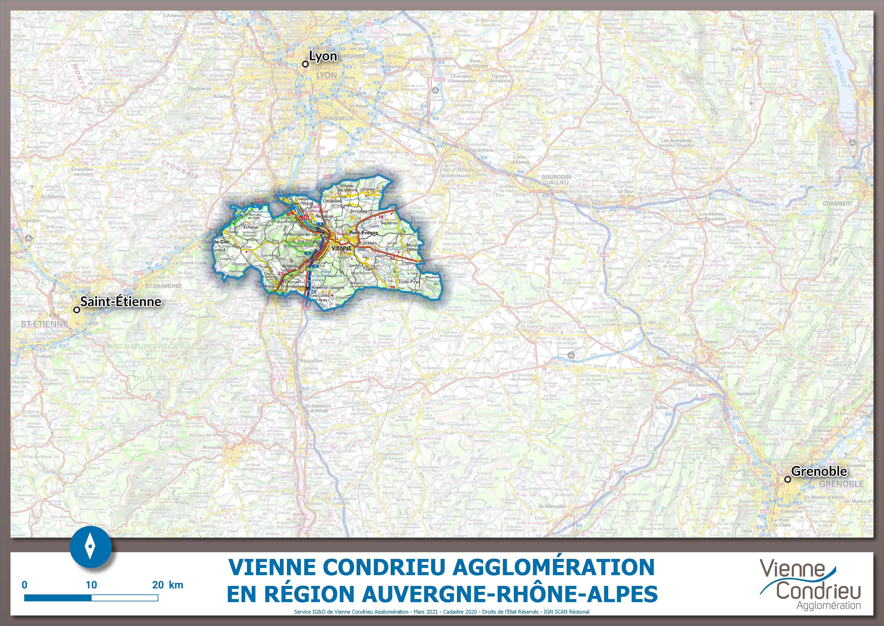

<!-- .slide: data-background-image="./assets/images/vca-territoire-black-bg.jpg"  -->
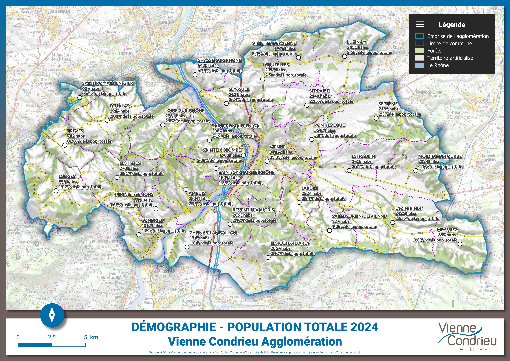

<!-- .slide: class="title"  -->
<!-- .slide: data-background-image="./assets/images/vca-black-bg.jpg"  -->
<h2>
    // 
    Vienne Condrieu Agglomération RÉALISATION D'UN MODÈLE NUMÉRIQUE DE TERRAIN (MNT) VIA LE LIDAR HD DE L'IGN
</h2>

<!-- .slide: data-background-image="./assets/images/vca-mnt.jpg"  -->
<h2>
    // 
    Qu'est-ce qu'un Module Numérique de Terrain (MNT) :
</h2>

Un modèle numérique de terrain (MNT) est une représentation en `2,5D` de la surface d'un territoire, **créée à partir des données d'altitude du terrain**. Le MNT ne prend pas en compte les objets présents à la surface du terrain tels que la végétation et les bâtiments. 

À contrario, un modèle numérique d'élévation (MNE) est une représentation des élévations sur un terrain comprenant la végétations et les bâtiments.

<!-- .slide: data-background-image="./assets/images/vca-mnt-ombrage.jpg"  -->
<h2>
    // 
    Réalisation d'un MNT : Le contexte (1/3)
</h2>

* Dans le cadre de l'élaboration de notre `PLUI`, VCA a engagé **la mise à jour des cartes des aléas naturels prévisibles** sur les 30 communes qui composent son territoire,
* À cette fin, `l'ONF et son service RTM` s'est vu confiée **une mission d'assistance technique** *(suivi du prestataire technique, pilotage technique, contrôle des versions documentaires)* pour la réalisation de la cartographie des aléas naturels sur nos 30 communes,
* Cela ne concerne que **les risques naturels**, à l'exclusion des risques d'inondations du fleuve Rhône et du PPRI du Gier.

<!-- .slide: data-background-image="./assets/images/vca-crue-gere-1993.jpg"  -->
<h2>
    // 
    Réalisation d'un MNT : Le contexte (2/3)
</h2>

Il s’agit donc d’étudier `l’ensemble des aléas naturels codifiés au titre du code de l’environnement`, à savoir : 
* Crue des rivières,
* Crues torrentielles,
* Ruissellements,
* Mouvements de terrains (sauf retrait/gonflement des argiles).

La production finale sera une **cartographie multirisques des aléas**.

<!-- .slide: data-background-image="./assets/images/vca-mnt-eboulement.jpg"  -->
<h2>
    // 
    Réalisation d'un MNT : Le contexte (3/3)
</h2>

Il a donc été décidé **d'homogénéiser la connaissance des aléas sur les 30 communes** :
* Pour garantir `la sécurité juridique du PLUi` (égalité),
* Pour bénéficier `d’1 seul zonage des risques` et `d’1 seul règlement`, pour **une instruction actualisée et fiabilisée en ADS**,
* Pour supprimer `les cartes d’aléas partielles` et de `compléter la connaissance des risques sur les plus vieux documents`,
* Pour bénéficier `d'une cartographie des aléas homogène et stabilisée` à long terme.

<!-- .slide: data-background-image="./assets/images/vca-mnt-modeilisation.jpg"  -->
<h2>
    // 
    Réalisation d'un MNT : le prérequis à la modélisation cartographique (1/2)
</h2>

Suite aux différents échanges avec nos prestataires, nous avions `différents scénarii` sur le choix du `MNT source` à fournir pour la `modélisation des aléas naturels` :
* L'utilisation côté `Isère` du MNT déjà produit par `AERODATA` et le `CRAIG` + complément à trouver côté `Rhône`,
* Acquisition `d'un nouveau relevé LIDAR de haute définition` sur le territoire de l'agglo pour générer le `MNT source`,
* Opportunité de l'utilisation du **nuage de points 3D Lidar HD classé de l'IGN** (fraîchement sorti en octobre 2023) pour produire le `MNT source`.

<!-- .slide: data-background-image="./assets/images/vca-mnt-modeilisation.jpg"  -->
<h2>
    // 
    Réalisation d'un MNT : le prérequis à la modélisation cartographique (2/2)
</h2>

Notre choix s'est donc porté sur l'`opportunité` de l'utilisation du **nuage de points 3D Lidar HD classé de l'IGN** pour produire le `MNT source` à la modélisation :
* Une **donnée déjà existante** - pas de **coût d'acquisition supplémentaire** et **en open data** (licence ouverte Etalab 2.0),
* Un **usage futur à définir et à tester**,
* Un MNT qu'il faudra **éprouver** dans le cadre de la modélisation.

<!-- .slide: data-background-image="./assets/images/vca-mnt-strategy.jpg"  -->
<h2>
    // 
    Réalisation d'un MNT : la procédure/stratégie d'élaboration
</h2>

Les grandes étapes du projet :
1. Téléchargement du tableau d'assemblage des données LIDAR HD classé (calepinage),
1. Préparation du calepinage en fonction du territoire de VCA,
1. Téléchargement des dalles du LIDAR HD classé,
1. Création des dalles du MNT via FME,
1. Assemblage final des dalles.

<!-- .slide: data-background-image="./assets/images/vca-mnt-tableau-assemblage.jpg"  -->
<h2>
    // 
    Réalisation d'un MNT : Tableau d'assemblage
</h2>

* Téléchargement du tableau d'assemblage des données LIDAR HD classé [sur l'open-data de l'IGN](https://geoservices.ign.fr/lidarhd#telechargementclassifiees),
* Création d'une couche de dalles sur l'ensemble du périmètre d'étude du MNT :
    * 864 dalles : ~ 1000m de côté - 1,002 km² - 865.728 km²,
* Création d'un maillage intermédiaire rassemblant `24 dalles de 1000m de côté` pour créer **un ensemble de supra-dalles** pour le scriptage sous FME :
    * Maillage de 36 dalles : 6 dalles en X / 4 dalles en Y - 6.005 km * 4.003 km - 24,040 km²,

<!-- .slide: data-background-image="./assets/images/vca-mnt-tableau-assemblage.jpg"  -->

<!-- .slide: data-background-image="./assets/images/vca-mnt-download.jpg"  -->
<h2>
    // 
    Réalisation d'un MNT : Téléchargement des données
</h2>

* Téléchargement des dalles du LIDAR HD classé :
    * Via mon maillage intermédiaire et le tableau d'assemblage dans lequel se trouve l'URL de téléchargement de la dalle,
    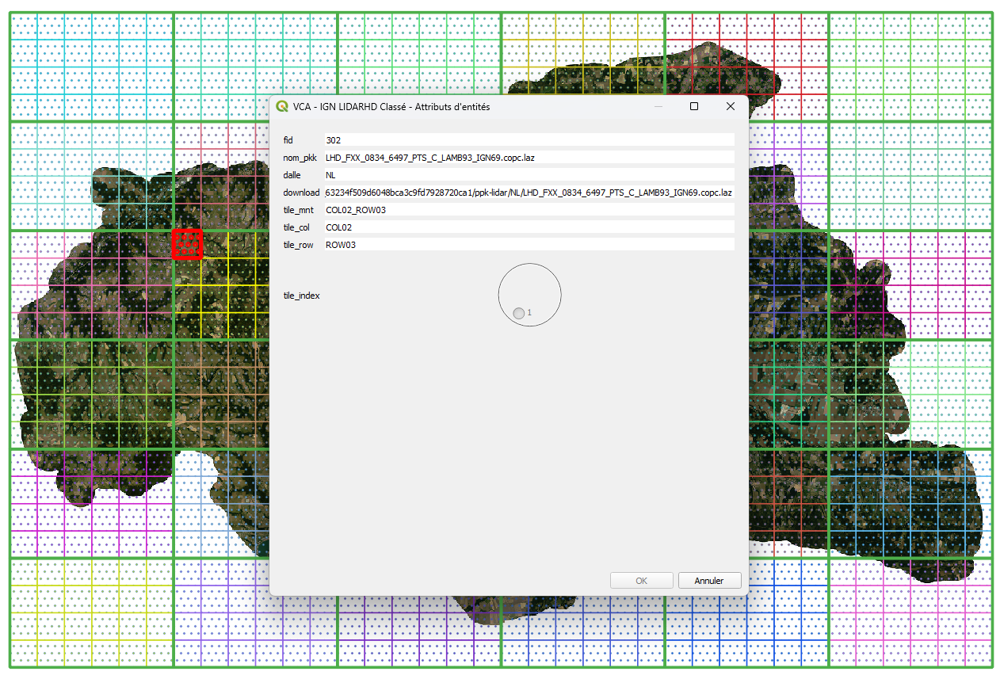

<!-- .slide: data-background-image="./assets/images/vca-mnt-download.jpg"  -->
* Téléchargement des dalles du LIDAR HD classé :
    * Via un utilitaire de téléchargement [PyLoad](http://localhost:7999/),
    * Et via la liste des URLs exportés sous Excel.

<!-- .slide: data-background-image="./assets/images/vca-mnt-strategy.jpg"  -->
<h2>
    // 
    Réalisation d'un MNT : Création des 36 dalles du MNT via FME
</h2>

* Aperçu du job FME :

<!-- .slide: data-background-image="./assets/images/vca-mnt-strategy.jpg"  -->
* Visualisation des résultats :

<!-- .slide: data-background-image="./assets/images/vca-mnt-strategy.jpg"  -->
<h2>
    // 
    Réalisation d'un MNT : Assemblage final des 36 dalles
</h2>

* FME :
    

<!-- .slide: data-background-image="./assets/images/vca-mnt-strategy.jpg"  -->
* Visualisation de l'assemblage :
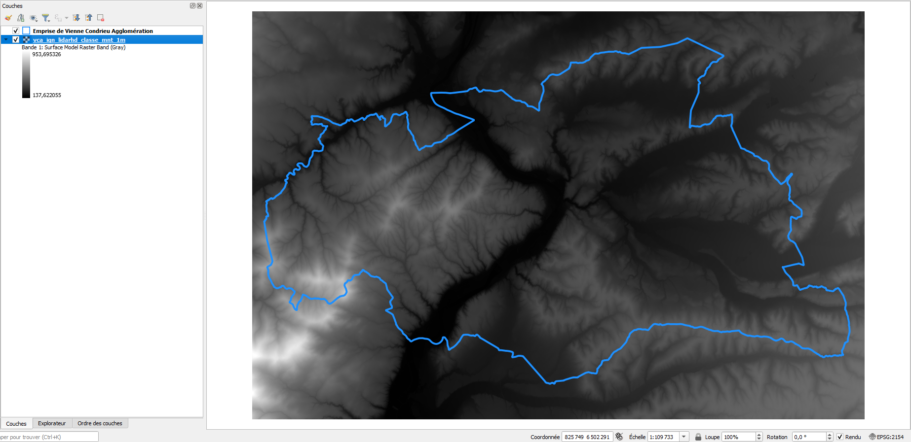

<!-- .slide: data-background-image="./assets/images/vca-mnt-retour-experience.jpg"  -->
<h2>
    // 
    Retours d'expérience (1/3)
</h2>

* Espace disque très volumineux :
    * `156.4 Go` pour la constitution des 36 dalles (864 dalles de 1000m de côté),
    * `5.9 Go` de fichiers *.TIF en résultats
    * `~ 10 Go` de fichiers *.TIF pour l'assemblage final.

<!-- .slide: data-background-image="./assets/images/vca-mnt-retour-experience.jpg"  -->
<h2>
    // 
    Retours d'expérience (2/3)
</h2>

* Temps machine pour la réalisation des 36 dalles du MNT :
    * `1ère dalle`: le mercredi 25 octobre 2023,
    * `36ème dalle` : le jeudi 16 novembre 2023,
    * Soit **23 jours** de temps machine,
    * Entre `6 et +12 heures` d'exécution suivant la densité de points pour la génération d'une dalle.

<!-- .slide: data-background-image="./assets/images/vca-mnt-retour-experience.jpg"  -->
<h2>
    // 
    Retours d'expérience (3/3)
</h2>

* Problème d'interpolation entre chaque dalle après l'assemblage des `36 dalles` :
    * Erreur effectuée : **pas de chevauchevement/recouvrement** des dalles,
    * Problème constaté par le bureau d'études en charge de la production des modélisations hydrologiques.
* Conséquence : apparition d'obstacles entre les dalles (seuils).

<!-- .slide: data-background-image="./assets/images/vca-mnt-retour-experience.jpg"  -->
<h2>
    // 
    Retours d'expérience (3/3)
</h2>

* Ruisseau de Galarot et son affluent aux Haies :
    * Pour la dalle nord, on a un pixel à 394.20m d’altitude :
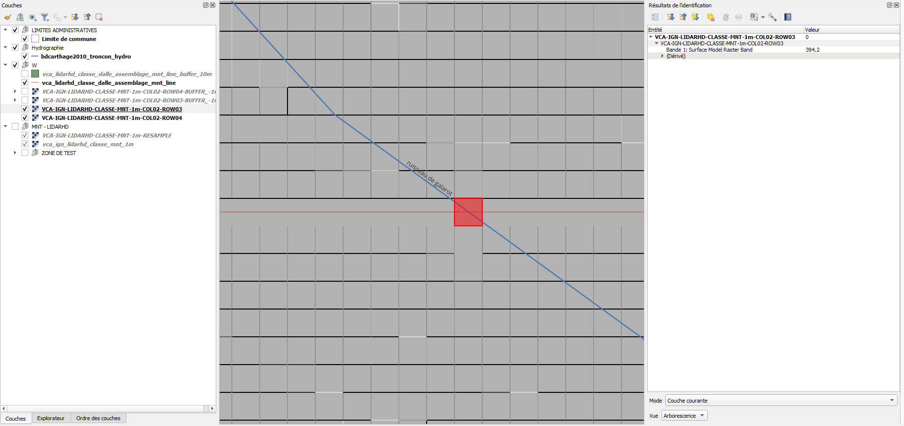

<!-- .slide: data-background-image="./assets/images/vca-mnt-retour-experience.jpg"  -->
<h2>
    // 
    Retours d'expérience (3/3)
</h2>

* Ruisseau de Galarot et son affluent aux Haies :
    * Pour la dalle sud,  on a un pixel à 409.816 m d’altitude :
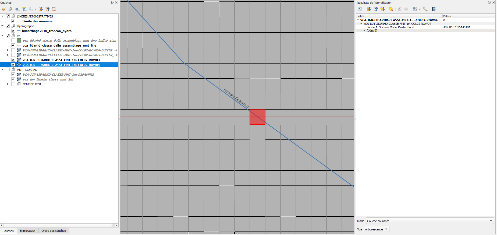

<!-- .slide: data-background-image="./assets/images/vca-mnt-retour-experience.jpg"  -->
<h2>
    // 
    Retours d'expérience (3/3)
</h2>

* Ruisseau de Galarot et son affluent aux Haies :
    * Visualisation de l'obstacle linéaire (seuil) :
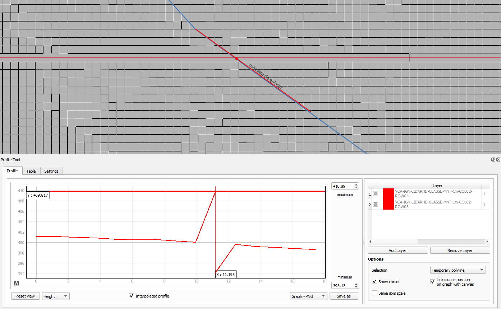

<!-- .slide: data-background-image="./assets/images/vca-mnt-retour-experience.jpg"  -->
<h2>
    // 
    Retours d'expérience (3/3)
</h2>

* Ruisseau de Galarot et son affluent aux Haies :
    * **Comment réctifier la donnée** `sans recommencer un mois de traitement` sous FME en implémentant le recouvrement :
        * Réalisation d'un buffer négatif de 1m sur les 36 dalles,
        * Réassemblage des 36 dalles en un fichier unique comportant des liserets de 1m sans donnée (valeur du pixel nulle),
        * Application du script `gdal_fillnodata.py` afin de ré-échantilloner les valeurs nulles (liseret de 1m) provoqué par le buffer négatif.

<!-- .slide: data-background-image="./assets/images/vca-mnt-retour-experience.jpg"  -->
<h2>
    // 
    Retours d'expérience (3/3)
</h2>

* Ruisseau de Galarot et son affluent aux Haies :
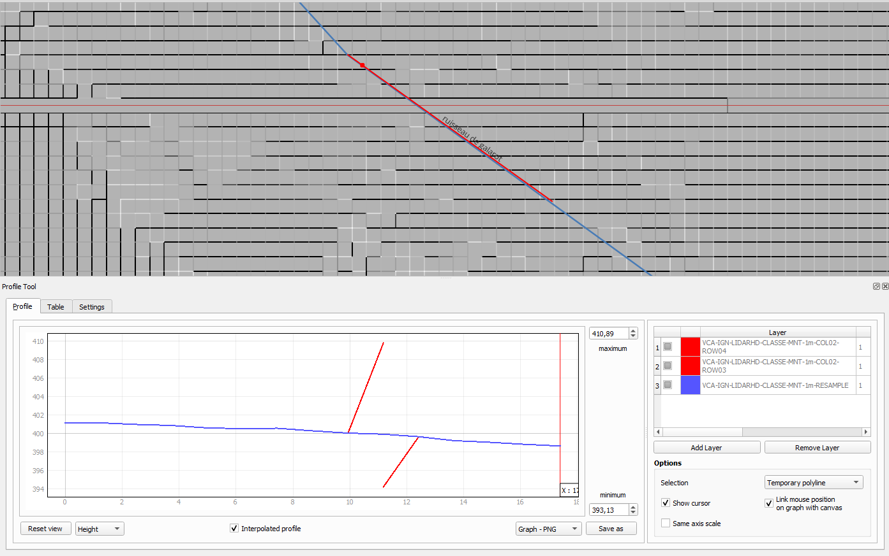

<!-- .slide: data-background-image="./assets/images/vca-ign-lidar-hd.jpg"  -->
<h2>
    // 
    Les usages (1/2)
</h2>

* Visualisation 3D du nuage de points - Utilitaire [potree](https://potree.github.io/)

<!-- .slide: data-background-image="./assets/images/vca-ign-lidar-hd.jpg"  -->
<h2>
    // 
    Les usages (2/2)
</h2>

* Visualisation du MNT & drappage de l'orthophoto - QGIS

<!-- .slide: class="title"  -->
<!-- .slide: data-background-image="./assets/images/vca-black-bg.jpg"  -->
<h2>
    // 
    Vienne Condrieu Agglomération SERVICE SIG
</h2>

<!-- .slide: data-background-image="./assets/images/vca-service-igeo.jpg"  -->
<h2>
    // 
    Coup de projecteur... Sur le service IG&O
</h2>

* Le service IG&O est composé de 2 personnes, ***Jean-Luc et Fabien***, et fait parti de la **Direction de l’Aménagement Urbain** (DAU) au sein du **Pôle Stratégie et Développement Territorial** (PSDT).

<!-- .slide: data-background-image="./assets/images/vca-bat-antares.jpg"  -->
<h2>
    // 
    Organigramme
</h2>

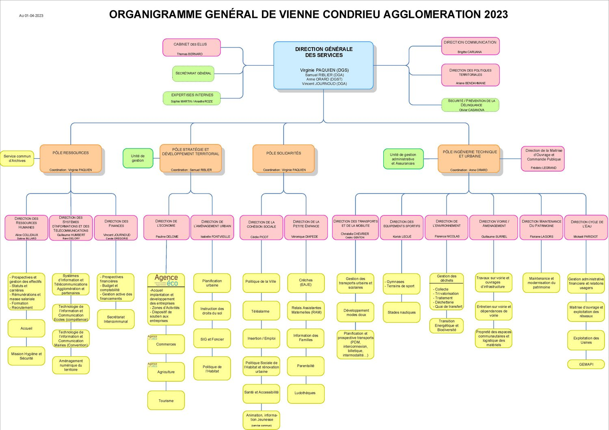

<!-- .slide: data-background-image="./assets/images/vca-service-epci-black-bg.jpg"  -->
<h2>
    // 
    Un service...
</h2>

* Qui répond aussi bien aux besoins :
    * En interne, pour les services de **l’Agglo**, 
    * Que pour les **30 communes** qui la composent.

Selon la demande, nous sommes amenés à travailler sur de l'aide à la saisie (mobilier urbain, arbres, box à vélos, PAV, etc.) et à produire des documents (cartes, tableaux) pour faciliter le travail des services et aider la prise de décision.

<!-- .slide: data-background-image="./assets/images/vca-service-transversalite-black-bg.jpg"  -->
<h2>
    // 
    Transversalité...
</h2>

* Nous avons un champ de compétence extrêmement large :
    * L'environnement (PAV, composte)
    * La communication (Open-data - partage de données avec le site web institutionnel),
    * Le développement économique (ZAE, Commerces, etc),
    * La voirie (tableau de classement),
    * Les transports (mode doux, transport scolaire),
    * Et j'en oublie !

<!-- .slide: data-background-image="./assets/images/vca-service-igeo-black-bg.jpg"  -->
<h2>
    // 
    Un service 3 en 1 = 3 métiers
</h2>

* `Géomaticien-généraliste` : En administrant la donnée géographique, de son acquisition à son analyse, en passant par sa représentation,
* `Géomaticien-informaticien` : En appliquant les outils informatiques au service de la donnée géographique ou en administrant nos serveurs,
* `Géomaticien-thématicien` : Dans le cadre de projets, le service exploite les données à disposition pour établir une analyse précise.
* **Avec ces trois spécialités**, le **service SIG** peut alors apporter des conseils sur la gestion de projets, une assistance et une veille technologique en recherche et développement. 

<!-- .slide: data-background-image="./assets/images/vca-panneau-agglo.jpg"  -->
<h2>
    // 
    Les aspects stratégiques
</h2>

Au niveau politique :
* Un portage politique globalement faible au sein de Vienne Condrieu Agglomération,
    * Pas de représentation en charge des données numériques et/ou SIG,
* En général, `la question du numérique` semble être pour l'heure encore peu visible dans les actions portées par les collectivités.

<!-- .slide: data-background-image="./assets/images/vca-organisation-black-bg.jpg"  -->
<h2>
    // 
    Les aspects stratégiques
</h2>

Au niveau du volet technique et organisationnel :
* Manque de transversalité dans les questions SIG,
* Méconnaissance de l'expertise interne en terme de la gestion de données SIG au sein de la collectivité,
* L'arrivée de nouveau collaborateur qui ont des connaissances sur les outils SIG tel que QGIS et une mise en place de sous-systèmes internes inconnus de notre service. Perte de connaissance, d'expertise et de mise en commun de la donnée.

<!-- .slide: class="title"  -->
<!-- .slide: data-background-image="./assets/images/vca-black-bg.jpg"  -->
<h2>
    // 
    Vienne Condrieu Agglomération ARCHITECTURE DU SYSTÈME D'INFORMATION GÉOGRAPHIQUE & DU SERVICE
</h2>

<!-- .slide: data-background-image="./assets/images/vca-architecture-maillage-black-bg.jpg"  -->
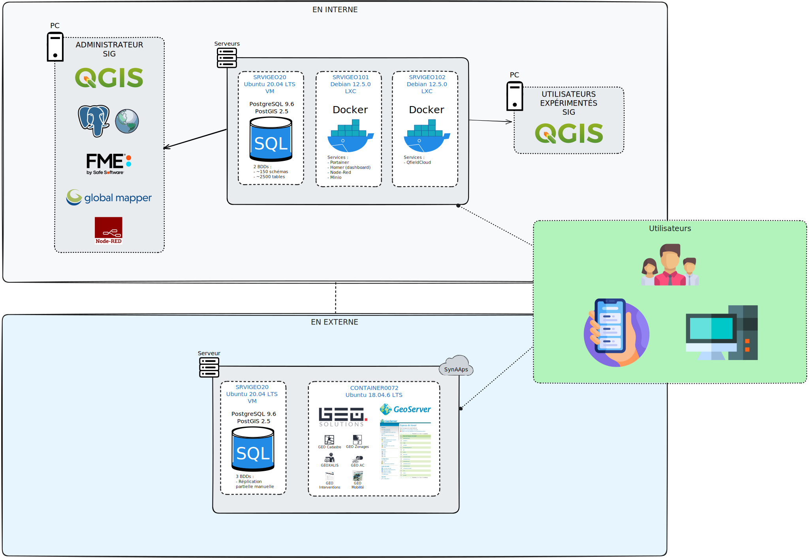

<!-- .slide: data-background-image="./assets/images/vca-geo-technologie.jpg"  -->
<h2>
    // 
    GEO : notre SIG Web
</h2>

Composé des briques logicielles suivantes :
* **GEO Générateur**, coeur de l'application, il s'articule sur ***4 axes principaux*** :
    * **les données**,
    **les fonctionnalités**,
    **les cartes**,
    **les applications**.
* **GEO Mobilité**,
* **GEO Interventions**,
* **[GEO API](https://geo-ressources.vienne-condrieu-agglomeration.fr/portail/presentation)**.

<!-- .slide: data-background-image="./assets/images/vca-geo-cadastre-ads.jpg"  -->
<h2>
    // 
    GEO : notre SIG Web
</h2>

La grande majorité de nos besoins en SIG Web sont propulsés via ces composants. On va notamment retrouver :
* le cadastre,
* les documents d'urbanisme,
* la voirie,
* Et pleins d'autres applications.

<!-- .slide: data-background-image="./assets/images/vca-geo-qgis.jpg"  -->
<h2>
    // 
    QGIS Desktop : notre outil d'administration
</h2>

QGIS est un Système d’Information Géographique Open Source et il est utilisé pour :
* les besoins quotidiens de visualisation de données SIG,
* pour la capture de données,
* pour l’analyse SIG avancée,
* et pour des présentations sous forme de cartes, d’atlas et de rapports sophistiqués.

Entres autres, QGIS prend en charge une multitude de formats de données rasters et vectorielles.

<!-- .slide: data-background-image="./assets/images/vca-postgres.jpg"  -->
<h2>
    // 
    PostgreSQL/PostGIS : notre base de données spatiale en interne
</h2>

**PostGIS** étend les capacités de la base de données relationnelle **PostgreSQL** en ajoutant la prise en charge du stockage, de l'indexation et de l'interrogation des données géographique.

En service depuis `mai 2010`, on comptabilise aujourd'hui :
* `2 bases principales` : ***vca*** et ***urbanisme*** en interne,
* plus de `150 schémas`,
* environ `2500 tables`.

<!-- .slide: data-background-image="./assets/images/vca-postgres.jpg"  -->
<h2>
    // 
    PostgreSQL/PostGIS : notre base de données spatiale sous GEO
</h2>

On va également retrouver le couple `PostgreSQL/PostGIS` sous GEO. C'est aussi notre référentiel par défaut.

Depuis `2008` et à l'époque sous `DynMAP`, on comptabilise aujourd'hui :
* `3 bases principales` : ***vca*** et ***urbanisme*** et ***geo_solutions*** (modules spécifiques),
* Un peu moins de données qu'en interne,
* Un réplication partielle manuelle.

<!-- .slide: data-background-image="./assets/images/vca-postgres.jpg"  -->
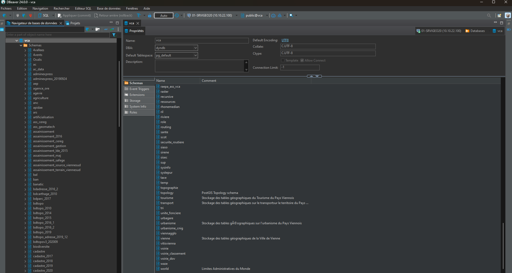

<!-- .slide: data-background-image="./assets/images/vca-postgres.jpg"  -->
<h2>
    // 
    PostgreSQL/PostGIS : référence en terme d'analyse
</h2>

On s'appuie `principalement` sur les requêtes SQL via PostGIS afin de réaliser les projets des services :

* Des couches de travail stockées en base de données :
    * Lieu de stockage unique,
    * Convention de nommage qui permet de mieux retrouver ses données,
    * Suppression de la multitude de couches temporaires au format ESRI Shapefile via les réquêtes `SQL CTE` (***Common Table Expression - expressions de tables communes***),
        * Une expression de table commune est un ensemble de résultats temporaire nommé.

<!-- .slide: data-background-image="./assets/images/vca-geo-processing.jpg"  -->
<h2>
    // 
    Traitements spécifiques : FME et Global Mapper
</h2>

Pour des traitements `un peu plus poussés/complexes`, on s'appuie sur :
* **FME** pour des `traitements nécessitant de grosses ressources machines` (MNT, LIDARHD, etc),
* **Global Mapper** pour le `traitement des fichiers RASTER image` (Orthophotos).

<!-- .slide: data-background-image="./assets/images/vca-impression.jpg"  -->
<h2>
    // 
    Impressions grand-format
</h2>

Pour les impressions grand-format et le scan de plans :
* HP Designjet T2600 :

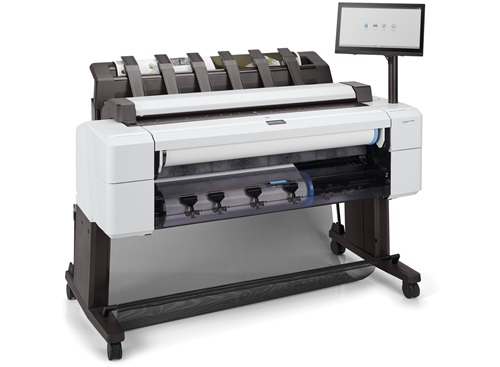

<!-- .slide: class="title"  -->
<!-- .slide: data-background-image="./assets/images/vca-black-bg.jpg"  -->
<h2>
    // 
    Vienne Condrieu Agglomération APPLICATIONS HISTORIQUES & PROJETS SIG
</h2>

<!-- .slide: data-background-image="./assets/images/vca-black-bg.jpg"  -->
<h2>
    // 
    Applications historiques
</h2>

* Le cadastre :
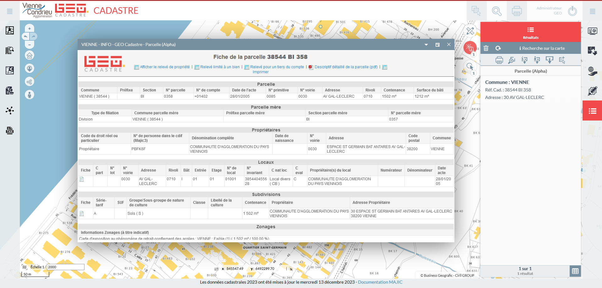

<!-- .slide: data-background-image="./assets/images/vca-black-bg.jpg"  -->
<h2>
    // 
    Applications historiques
</h2>

* L'administration du droit des sols :
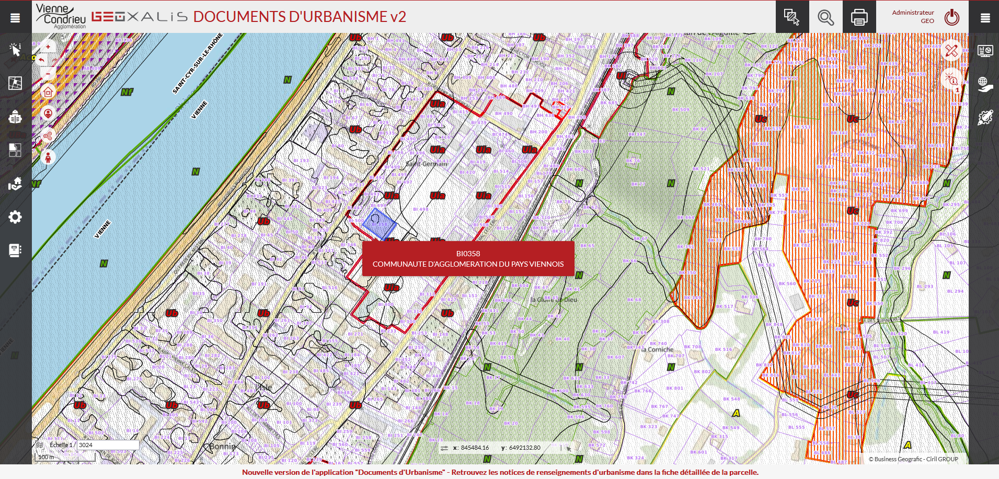

<!-- .slide: data-background-image="./assets/images/vca-black-bg.jpg"  -->
<h2>
    // 
    Applications historiques
</h2>

* Gestion du réseau d'assainissement :
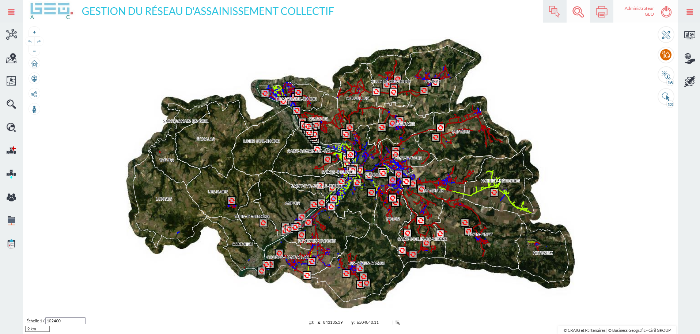

<!-- .slide: data-background-image="./assets/images/vca-black-bg.jpg"  -->
<h2>
    // 
    Applications historiques
</h2>

* Environnement :
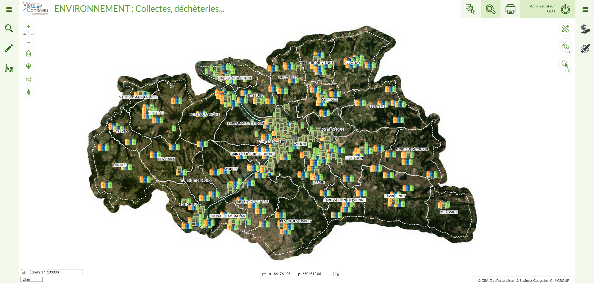

<!-- .slide: data-background-image="./assets/images/vca-black-bg.jpg"  -->
<h2>
    // 
    Applications historiques
</h2>

* [Cartothèque GEO](https://geo.vienne-condrieu-agglomeration.fr/)

<!-- .slide: data-background-image="./assets/images/vca-black-bg.jpg"  -->
<h2>
    // 
    Nos projets (1/5)
</h2>

* Refonte de l'application de la gestion du réseau d'assainissement :
    * Architecture hybride : QGIS <-> GEO
* Expérimentation de cette architecture positive avec l'application de gestion du réseau d'eau potable,

<!-- .slide: data-background-image="./assets/images/vca-black-bg.jpg"  -->
<h2>
    // 
    Nos projets (2/5)
</h2>

* Axe d'amélioration :
    * Ajout du support de `MINIO` (***Minio est un serveur de stockage d’objets open-source populaire, auto-hébergeable et compatible avec le service de stockage cloud Amazon S3***) sous QGIS en interne et synchronisation avec GEO.

<!-- .slide: data-background-image="./assets/images/vca-black-bg.jpg"  -->
<h2>
    // 
    Nos projets (3/5)
</h2>

* **CCTP Topographie** :
    * Dans le cade de `notre marché de relevé topo`, être en capacité d'importer directement via les relevés topo réalisés, le réseau d'assanissement et d'eau potable.
        * Premiers tests effectués avec MAPPIA via GO Valid concluant,
        * À travailler pour une implémentation en production.
* **Saisie SIG** :
    * S'équiper d'un `rover RTK  du projet Centipede` afin de saisir via QfieldCloud,

 <!-- .slide: data-background-image="./assets/images/vca-black-bg.jpg"  -->
<h2>
    // 
    Nos projets (4/5)
</h2>

* Mise en place d'une plateforme `QfieldCloud` :
    * QFieldCloud permet de synchroniser et de fusionner les données collectées par votre équipe dans QField. Des petits projets individuels aux grandes campagnes de collecte de données, QFieldCloud supprime les difficultés liées à la synchronisation et à la fusion des données.
 

  <!-- .slide: data-background-image="./assets/images/vca-black-bg.jpg"  -->
<h2>
    // 
    Nos projets (5/5)
</h2>

* **Panoramax** :
    * Base vues immersives libres - L’alternative libre à `Google Streetview` pour photo-cartographier les territoires.